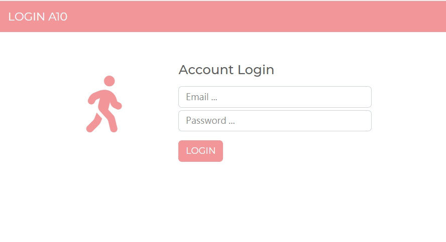
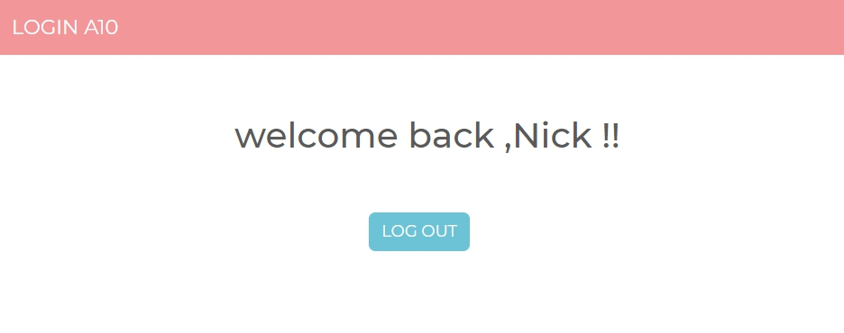

# 帳號登入登出器 (LOGIN)

有登入、登出及保持狀態的登入器

## 產品功能 (Features)
- 使用者可使用測試帳號登入
- 使用者登入後，下次造訪網頁可以自動登入
- 測試帳號如下
```
    firstName: 'Tony',
    email: 'tony@stark.com',
    password: 'iamironman'
  ,
    firstName: 'Steve',
    email: 'captain@hotmail.com',
    password: 'icandothisallday'
  ,
    firstName: 'Peter',
    email: 'peter@parker.com',
    password: 'enajyram'
  ,
    firstName: 'Natasha',
    email: 'natasha@gamil.com',
    password: '*parol#@$!'
  ,

    firstName: 'Nick',
    email: 'nick@shield.com',
    password: 'password'
```

## 安裝 ( Installing )
1. 選定資料夾，開啟終端機，存放本專案
```
git clone https://github.com/yuchengH1988/login_A10
```

2. 進入資料夾後，安裝套件
```
npm install
```

3. 啟動伺服器
```
npm run dev
``` 

4. 開始瀏覽器
```
在瀏覽器進入 http://localhost:3000
``` 

## 環境建置與需求 (prerequisites)
- Node.js 10.15.0
- express 4.17.1

## 預覽圖 ( preview image)

#### 首頁



#### 結果頁面



### 作者
[Calvin Huang](https://github.com/yuchengH1988)